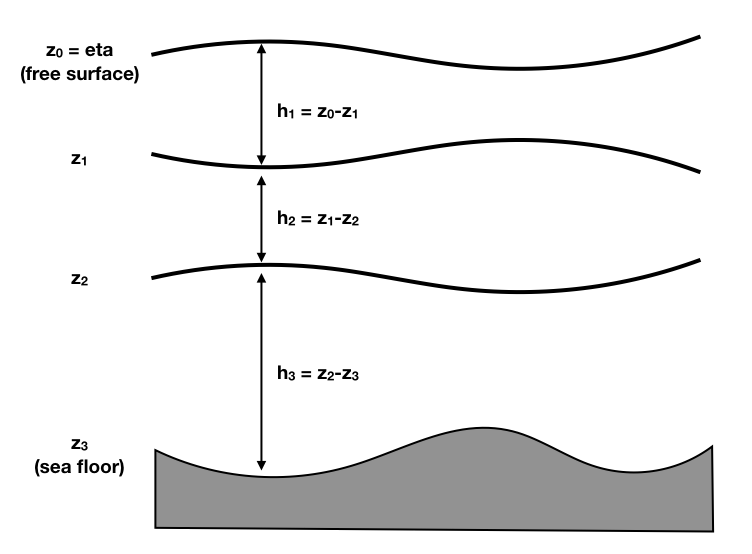

Equations of motions
===========================

Continuous form
---------------

Boussinesq, adiabatic, hydrostatic and nonlinear shallow water equations for conservation of momentum:

.. math::

   \partial_t \mathbf{u}_n(x,y) + (\zeta_n + f) \mathbf{k}\times\mathbf{u}_n  = -\nabla \Big \{ M_n + \frac{1}{2} |\mathbf{u}_n|^2 + g \Pi \Big \}
               + \mathbf{H}_n + \mathbf{V}_n

for :math:`n=0,\cdots N-1` and where :math:`f` is the Coriolis frequency and :math:`\zeta_n = \mathbf{k}\cdot (\nabla \times \mathbf{u}_n )`
is the relative vorticity, :math:`M_n` is the perturbation Montgomery potential.
The latter is given by:

.. math::

   z_0 &= \eta

   z_n &= z_{n-1} - h_n, n > 0

.. math::

   M_0 &= g \eta

   M_n &= M_{n-1} + g (\rho_{n}-\rho_{n-1})/\rho_n \times z_{n-1}, n>0

.. math::

   p_n(x,y,z) = \rho_n M_n(x,y) - g \rho_n z

Thickness tendency equations:

.. math::

   \partial_t h_n(x,y) + \nabla \cdot (\mathbf{u}_n h_n )  = 0.

References: ...

Spectral discretization
-----------------------

Temporal discretization
-----------------------

AB or RK for now, time splitting latter

Hallberg09, Vitousek14

QG formulation
-----------------------

